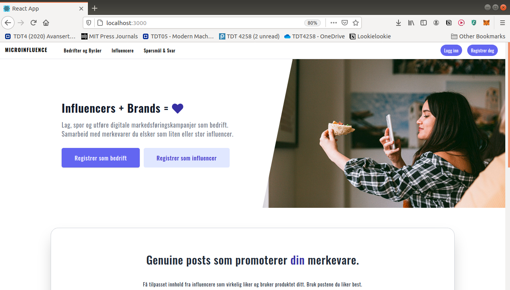
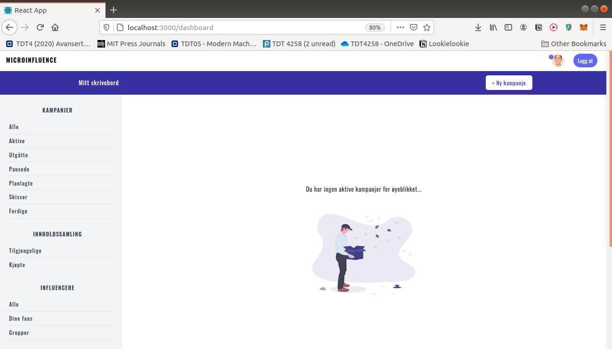
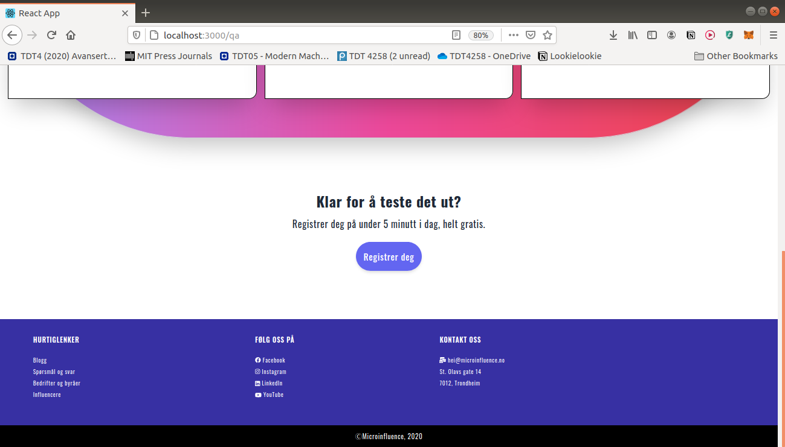
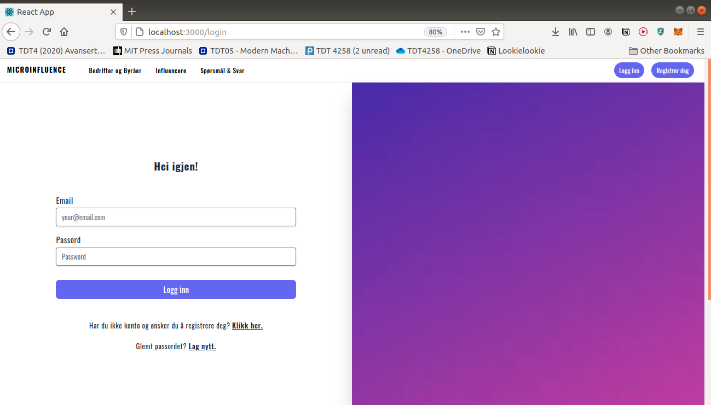
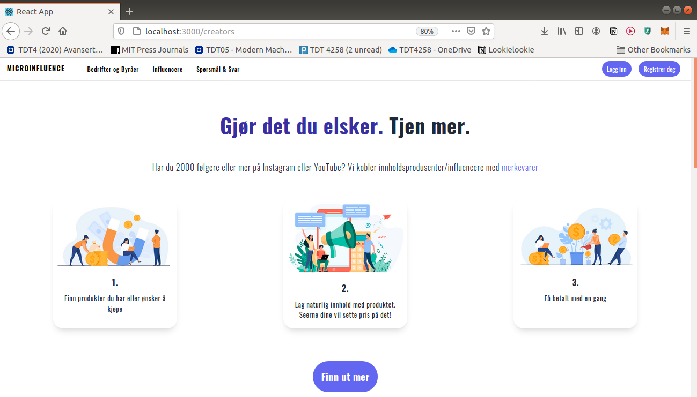
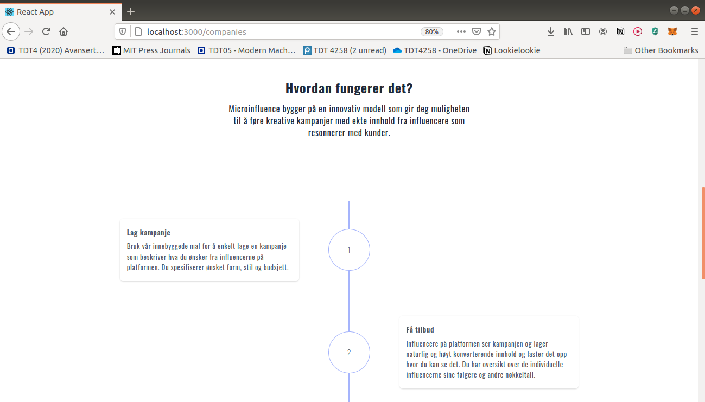

Microinfluence Functionality Specs

A backend API and a frontend SPA for a marketplace that connects brands and agencies
with creators and influencers.

Creators

- Should be able to register basic information, log in and out
- Should be able to reset password
- Customize their profile and connect social accounts
- Browse campaigns
- Have campaigns recomended to them 
- Upload proposals (images/videos) to an active campaign
- Set a price for the uploaded content
- Have a dashboard showing earned income and status of submitted content

Brands

- Should be able to register basic information, log in and out.
- Should be able to reset password
- Should be able to customize their profile
- Should be able to browse and filter creators based on target audience and reach
- Should have a dashboard highlighting marketing spend and reach
- Should be able to create new campaigns.
- Campaigns should be able to be saved as a draft.
- Brands should be able to set a budget for a campaign
- Brands should be able to set an expiration date until when images can be submitted
- Should be able to quickly select and pay for desired content submitted to a campaign
- Should be able to browse their campaigns (active, inactive, drafts etc. ) 
- Should be able to browse available and previously bought content

